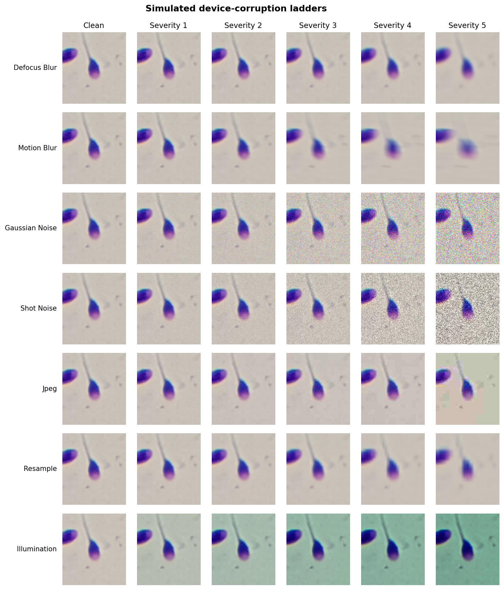

# Calibration Under Shift

[](https://github.com/akshat0714/calibration-under-shift/actions/workflows/ci.yml)

I tested whether ECE, predictive entropy, selective risk, or APS coverage reached prespecified degradation thresholds before raw-softmax accuracy fell by more than five percentage points under simulated device shift.

I found that no reliability signal crossed before the accuracy-drop threshold in any of the 10 comparisons where both crossings occurred. Six other signals never crossed. The prespecified early-warning hypothesis was therefore not supported at these thresholds on SMIDS and HuSHeM. Temperature scaling fitted on clean calibration data reduced severity-5 ECE for all three SMIDS backbones and increased it for HuSHeM ResNet50.


**Figure 1.** I normalized each measure to its prespecified threshold. Clean performance is 0 and the threshold is 1. X marks the first crossing. A missing X means that a measure did not cross. I averaged the seven corruptions within each seed or fold before summarizing replicates.

## Primary result

| Dataset and backbone | Replicates | Accuracy drop | ECE | Predictive entropy | Selective risk at 80% | APS coverage |
|---|---|---|---|---|---|---|
| SMIDS ResNet50 | 5 seeds | S3 | S3 | Not reached | S3 | Not reached |
| SMIDS Xception | 3 seeds | S3 | S3 | S5 | S3 | Not reached |
| SMIDS MobileNetV3-Large | 3 seeds | S2 | S2 | Not reached | S2 | S4 |
| HuSHeM ResNet50 | 5 folds | S3 | Not reached | S4 | S4 | Not reached |

I observed either the same crossing severity as accuracy or a later one for every reliability measure that crossed. I did not replace a missing crossing with severity 5.

These results do not show that uncertainty methods are generally ineffective. My secondary analyses show useful per-sample error ranking and selective prediction. They do show that these aggregate measures did not provide an earlier degradation indication under my prespecified definitions. I would not use uncertainty dashboards alone as degradation alarms. Paired-device validation and ongoing monitoring remain necessary.

## Study design

| Dataset | Task and model matrix | Split design | Main limitation |
|---|---|---|---|
| SMIDS | Three-class sperm images with ResNet50 by 5 seeds, Xception by 3 seeds, and MobileNetV3-Large by 3 seeds | Stratified train, validation, calibration, and test shares of 70, 10, 10, and 10% | The release has no patient or source-field identifier |
| HuSHeM | Four-class sperm-head morphology with ResNet50 across 5 folds | Five stratified outer folds with separate train, validation, calibration, and test roles | The release reports 15 patients but provides no image-to-patient map |
| Kromp | Proposed blastocyst task | A patient-grouped split would be required | I excluded it because the release lacks verified patient linkage and contains unresolved duplicate and annotation issues |

I trained every model on clean training images. I used validation macro-F1 to select checkpoints. I fitted scalar temperature scaling, vector scaling, and APS only on the separate clean calibration role. I applied corruptions only during evaluation. I excluded the SMIDS pilot and synthetic demo from the scientific results.

I defined the aggregation order, severities, and threshold rules in [`configs/analysis_protocol.yaml`](configs/analysis_protocol.yaml) before the full evaluation. Accuracy crossed after a drop greater than 0.05. ECE, entropy, and selective risk used both relative and absolute increases. APS crossed below 0.85. I counted a reliability measure as earlier only when both crossings existed and its severity was lower.

## Clean test results

| Dataset and backbone | Accuracy mean ± sample SD | Macro-F1 mean ± sample SD |
|---|---|---|
| SMIDS ResNet50 | 89.7% ± 0.7 | 89.7% ± 0.7 |
| SMIDS Xception | 88.8% ± 2.2 | 88.9% ± 2.1 |
| SMIDS MobileNetV3-Large | 88.9% ± 1.6 | 89.0% ± 1.6 |
| HuSHeM ResNet50 | 86.5% ± 7.8 | 86.5% ± 7.9 |

I interpret the HuSHeM variation cautiously. Four test folds contain 43 images and one contains 44. One classification changes fold accuracy by 2.27 to 2.33 percentage points. The reported spread combines model variation, fold composition, and small-sample test resolution.

MobileNetV3-Large reached 88.9% clean accuracy on SMIDS and ResNet50 reached 89.7%. I report this descriptive similarity because the compact model is relevant to on-device diagnostic deployment research. I did not test statistical equivalence or deployment readiness.

## Secondary and exploratory analyses

I kept these analyses separate from the primary result.

- **Per corruption.** I applied the same thresholds separately to all seven corruptions. Both thresholds were reached in 58 of 112 correlated comparisons. None showed an earlier reliability crossing. The signal did not cross in the other 54 comparisons.
- **Failure detection.** I measured raw-softmax failure AUROC from severity 1 to severity 5. SMIDS ResNet50 changed from 0.817 to 0.697. Xception changed from 0.839 to 0.695. MobileNetV3-Large changed from 0.807 to 0.657. HuSHeM ResNet50 changed from 0.815 to 0.704. The SMIDS ensemble changed from 0.836 to 0.732.
- **Selective prediction.** At 80% retention, energy selection increased retained accuracy by 3.6 to 5.2 percentage points at severities 3 and 4 across the four single-backbone settings. Ensemble entropy increased retained accuracy by 5.2 and 5.4 points at severities 3 and 4. I treat these as ranking results at a fixed review budget, not as a clinical policy.
- **Conformal prediction.** From clean data to severity 5, APS coverage changed from 0.977 to 0.865 for SMIDS ResNet50, 0.958 to 0.760 for MobileNetV3-Large, 0.987 to 0.869 for Xception, and 0.958 to 0.942 for HuSHeM. Mean set size increased from 1.761 to 1.910, 1.546 to 1.822, 1.873 to 1.994, and 2.311 to 2.966.
- **Temperature scaling.** At severity 5, raw and scaled ECE were 0.274 and 0.251 for SMIDS ResNet50, 0.397 and 0.384 for MobileNetV3-Large, 0.181 and 0.178 for Xception, and 0.184 and 0.198 for HuSHeM.
- **Attribution.** I treated the Grad-CAM and Grad-CAM++ defocus analysis as exploratory. The [qualitative result](results/attribution/attribution_grid.png) and [quantitative result](results/figures/f7_attribution_stability_accuracy.png) have separate provenance.

As a post-hoc observation, I noted that the relative threshold depends on the clean baseline. HuSHeM clean ECE was 0.132, so the 2× rule required ECE to exceed 0.264 as well as the minimum absolute increase. I did not revise the primary definition. I would specify absolute-threshold or AUROC-style detection protocols before a future evaluation.

I provide [reliability diagrams](results/figures/f2_reliability_diagrams.png), [risk coverage curves](results/figures/f3_risk_coverage.png), [failure detection AUROC](results/figures/f4_failure_detection_auroc.png), [conformal results](results/figures/f5_conformal.png), and [per corruption results](results/figures/appendix/). I register their source data and hashes in [`results/figure_data/final_figure_manifest.json`](results/figure_data/final_figure_manifest.json).

## Simulated device shift

I used deterministic ordinal settings. I do not claim that they reproduce a named phone or microscope.

| Corruption | Intended approximation | Severity 1 to severity 5 at a 224 pixel short side |
|---|---|---|
| Defocus blur | Lower numerical aperture optics or autofocus error | Gaussian sigma values of 0.5, 1, 2, 3, and 5 pixels |
| Motion blur | Handheld exposure blur | Kernel lengths of 5, 11, 19, 31, and 45 pixels |
| Gaussian noise | ImageNet-C independent-channel additive baseline | Sigma values of 0.02, 0.04, 0.08, 0.12, and 0.18 on the 0 to 1 range |
| Shot noise | Post-demosaic approximation of photon-limited acquisition | Effective luminance counts of 4096, 1024, 256, 64, and 16 |
| JPEG | Lossy image encoding and transfer | Quality values of 80, 60, 40, 25, and 12 |
| Down and up resampling | Reduced spatial resolution or sensor density | Factors of 1.5, 2.25, 3.5, 5.5, and 8 with bilinear restoration |
| Gamma and white balance | Global illumination and color processing | Base gamma values from 0.85 to 0.50 or their reciprocals with a per-image RGB direction |

I deliberately followed the ImageNet-C per-channel Gaussian noise convention for comparability with prior work. This makes Gaussian noise the least physically realistic corruption by design. I implemented shot noise as the physically motivated counterpart. It uses a post-demosaic approximation with a luminance-derived Poisson residual shared across RGB channels.

For illumination, I derived a deterministic seed for each image. The seed fixes its gamma branch and zero-mean RGB direction across severity. The displayed seed 1729 example darkens the image and shifts it toward green and teal. I do not impose that direction on every evaluation image.



I record the exact settings and source image in [`results/figures/corruption_grid.json`](results/figures/corruption_grid.json).

## Relation to prior work

Thirumalaraju et al. reported intermodel and cross-center variability despite similar average performance. My result addresses a different question. I found that standard reliability measures did not reach their prespecified thresholds before accuracy. I treat the relationship as context rather than a direct comparison.

Kanakasabapathy et al. studied lossy acquisition and device or domain quality in clinical and smartphone imaging. I test a narrower monitoring question with simulated image changes. Ovadia et al. showed that calibration fitted in-distribution can transfer poorly under shift. My mixed temperature scaling result is consistent with that concern but is not a replication.

## Reproduction

I tested the repository with Python 3.11. I use a full-history clone because figure provenance checks the recorded training and evaluation revisions.

```bash
git clone https://github.com/akshat0714/calibration-under-shift.git
cd calibration-under-shift
bash run.sh --setup
MPLBACKEND=Agg bash run.sh --eval-only
```

The evaluation command performs the following steps.

1. It downloads and verifies SMIDS and HuSHeM. It does not download Kromp.
2. It verifies the saved split roles and HuSHeM folds.
3. It downloads the [checkpoint release](https://github.com/akshat0714/calibration-under-shift/releases/tag/stage1-gcp-handoff-v1). It verifies archive SHA-256 `06510f8813eb2f67b11268ebcb2761fbb616c777bf37364ca8bda2b485a0105f` and installs exactly 16 checkpoints.
4. It regenerates the full evaluation, threshold analysis, corruption grid, attribution analysis, final figures, and per-corruption appendices under `results/reproduction/`.
5. It requires 45,540 metric rows, 17 detail files, the exact primary result, portable paths, and matching values before writing `verification.json`.

The command selects CUDA or Apple MPS and refuses an implicit CPU run. I measured a fresh clone on macOS using Apple MPS at 42 minutes and 29 seconds with `CALIBRATION_DEVICE=mps` and `CALIBRATION_NUM_WORKERS=0`. A later verified run took 26 minutes and 55 seconds. I have not measured the T4 runtime. I record both checks in [`REPRODUCIBILITY.md`](REPRODUCIBILITY.md).

I use the following command when I want to retrain all models.

```bash
# CUDA only
bash run.sh --full-retrain
```

The retraining command resumes completed members from its registry and checks the clean performance requirements before evaluation. I keep `bash run.sh --demo` as a synthetic engineering test. I do not use its output as scientific evidence.

## Repository structure

```text
configs/                 model settings and the prespecified analysis protocol
data/metadata, splits/   audited metadata and saved split manifests
experiments/             training, evaluation, analysis, and reproduction code
notebooks/               results walkthrough without training
scripts/                 data download, release verification, and figure utilities
src/                     data, models, shifts, metrics, uncertainty, attribution, and plots
tests/                   unit, protocol, provenance, notebook, and integration tests
results/                 committed metrics, figures, audits, and provenance
```

## Limitations

I used public proxy datasets and simulated image changes rather than paired-device captures. SMIDS and HuSHeM do not provide image-level patient or source linkage. HuSHeM is small. Kromp remains excluded until patient linkage and annotation issues are resolved. I did not evaluate a held-out clinical center.

My simulations omit the full optics, Bayer sampling, demosaicing, denoising, sharpening, tone mapping, and color processing of a phone. ECE depends on binning. Temperature scaling corrects only global confidence sharpness. APS provides marginal coverage under exchangeability, not a per-class or shifted distribution guarantee. Grad-CAM is not a causal explanation.

I do not claim clinical validation, a clinical decision policy, model equivalence, or general failure of uncertainty methods.

## Citations and licenses

I based the study on work by [Thirumalaraju et al.](https://doi.org/10.1016/j.fertnstert.2025.08.021), [Kanakasabapathy et al.](https://doi.org/10.1038/s41551-021-00733-w), [Ovadia et al.](https://proceedings.neurips.cc/paper_files/paper/2019/hash/8558cb408c1d76621371888657d2eb1d-Abstract.html), [Guo et al.](https://proceedings.mlr.press/v70/guo17a.html), [Hendrycks and Dietterich](https://openreview.net/forum?id=HJz6tiCqYm), and [Angelopoulos and Bates](https://doi.org/10.1561/2200000101).

I document dataset sources, checksums, release limitations, and CC BY 4.0 terms in [`DATASETS.md`](DATASETS.md). I do not redistribute the raw archives. I release the code under GPL 3.0 only. Image portions of the audit and corruption figures retain their source dataset licenses.
