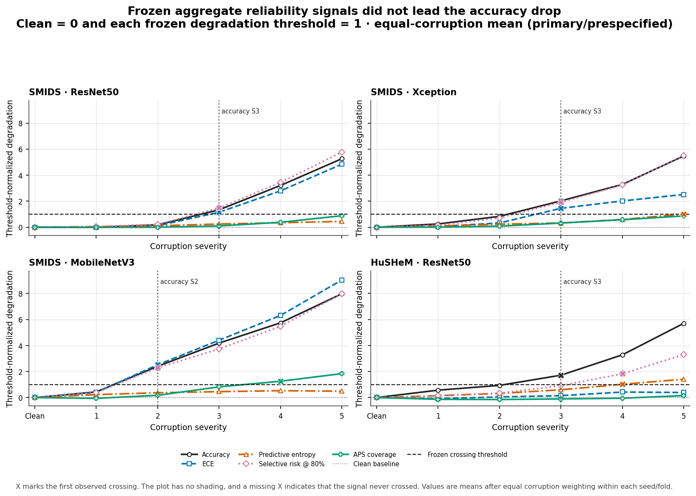

# Calibration Under Shift

## Abstract

I tested whether common reliability measures identified simulated image degradation before classification accuracy fell by more than five percentage points. I trained 16 models on clean SMIDS or HuSHeM images and fitted post-hoc methods on separate clean calibration data. I evaluated the same test images under seven corruptions at five severity levels. In all 10 comparisons where both thresholds were reached, the reliability crossing occurred at the same severity as the accuracy crossing or later. Six additional signals never reached their thresholds. My prespecified hypothesis was not supported at these thresholds on these datasets. Temperature scaling fitted on clean data reduced severity-5 ECE for all three SMIDS backbones and increased it for HuSHeM ResNet50. I make no clinical claim from these public proxy data.

## Question and hypothesis

I studied whether standard reliability measures provide an earlier indication of degradation than accuracy under a controlled sequence of simulated image changes. Prior work by Kanakasabapathy et al. examined lossy acquisition and device or domain shift in medical images [2]. Thirumalaraju et al. reported substantial intermodel and cross-center variation despite similar average performance [1].

I recorded the following hypothesis before running the full shifted evaluation. I preserve its original plural voice because it is the exact prespecified statement.

> We predict that calibration error and predictive uncertainty will degrade at lower simulated device-corruption severities than classification accuracy. We will test this by measuring accuracy, macro-F1, ECE, adaptive ECE, NLL, Brier score, uncertainty, selective risk, and conformal coverage across fixed severity ladders applied only at evaluation time. The hypothesis is falsified if prespecified reliability thresholds are not crossed before a five-percentage-point accuracy drop, consistently across datasets and seeds.

I recorded the aggregation order, thresholds, and missing crossing rule in `configs/analysis_protocol.yaml`. This was a local prespecification rather than an external registration. I did not change these definitions after seeing the results.

## Methods

### Data and model training

I used SMIDS for three-class sperm image classification [7]. I used HuSHeM for four-class sperm-head morphology classification across five stratified outer folds [8]. Neither release provides image-level patient or source linkage. I therefore treat both as public proxy evaluations rather than patient-level evaluations.

My model matrix contains five SMIDS ResNet50 seeds, three SMIDS Xception seeds, three SMIDS MobileNetV3-Large seeds, and HuSHeM ResNet50 across five folds. I trained every model on clean images and selected checkpoints by validation macro-F1. Temperature scaling, vector scaling, and APS used only the clean calibration role. Test images fitted no method. I applied corruptions only during evaluation. The five SMIDS ResNet50 models formed the ensemble. I excluded the pilot and synthetic demo from every scientific summary.

I excluded the Kromp blastocyst release from modeling [9]. The public files do not provide verified patient linkage and contain unresolved duplicate and annotation issues. I did not interpret filename prefixes as patient identifiers.

### Simulated image changes

I applied defocus blur, motion blur, Gaussian noise, shot noise, JPEG compression, resampling, and gamma with white balance changes at severities 1 through 5. I used these as ordinal sensitivity settings rather than equivalents of a named device.

I deliberately followed the ImageNet-C per-channel Gaussian noise convention for comparability with prior work [4]. This makes Gaussian noise the least physically realistic corruption by design. I implemented shot noise as the physically motivated counterpart. It uses a post-demosaic approximation with a luminance-derived Poisson residual shared across RGB channels. For illumination, I used a deterministic per-image gamma branch and zero-mean RGB direction that remained fixed across severity. The displayed seed 1729 example darkens the image and shifts it toward green and teal. I did not apply that direction to every image.

### Reliability methods and primary analysis

I recorded classification, calibration, risk-coverage, failure-detection AUROC, 30-pass MC dropout, ensemble uncertainty, APS, energy, and Mahalanobis results. Temperature scaling used clean calibration logits [5]. APS used a finite-sample corrected split-conformal quantile at 90% nominal coverage [6].

For the primary analysis, I averaged the seven corruptions within each seed or fold and then summarized replicates. Accuracy crossed after a drop greater than 0.05 from clean performance. ECE crossed when it exceeded two times clean ECE and increased by at least 0.02. Predictive entropy used two times clean entropy and a 0.05 minimum increase. Risk at 80 percent retention used two times clean risk and a 0.02 minimum increase. APS coverage crossed below 0.85. I counted a reliability measure as earlier only when both crossings existed and the reliability severity was lower. I kept missing crossings missing.

## Results

### Clean test performance

| Dataset | Backbone | Accuracy mean ± sample SD | Macro-F1 mean ± sample SD |
|---|---|---|---|
| SMIDS | ResNet50 | 89.7% ± 0.7 | 89.7% ± 0.7 |
| SMIDS | Xception | 88.8% ± 2.2 | 88.9% ± 2.1 |
| SMIDS | MobileNetV3-Large | 88.9% ± 1.6 | 89.0% ± 1.6 |
| HuSHeM | ResNet50 | 86.5% ± 7.8 | 86.5% ± 7.9 |

I interpret the HuSHeM spread in light of its small test folds. Four folds contain 43 images and one contains 44. One classification changes fold accuracy by 2.27 to 2.33 percentage points. The spread includes model variation, fold composition, and limited test resolution. Thirumalaraju et al. provide context for this variability, but I do not compare effect sizes [1].

MobileNetV3-Large reached 88.9% clean accuracy on SMIDS and ResNet50 reached 89.7%. This descriptive similarity is relevant to on-device diagnostic deployment research. It does not establish equivalence or deployment readiness.

### Primary threshold result

**Figure 1.** I normalized every measure to its prespecified threshold. Clean performance is 0 and the threshold is 1. I mark the first crossing with X. I leave the marker absent when a measure does not cross.

| Dataset and backbone | Replicates | Accuracy drop | ECE | Predictive entropy | Selective risk at 80% | APS coverage |
|---|---|---|---|---|---|---|
| SMIDS ResNet50 | 5 seeds | S3 | S3 | Not reached | S3 | Not reached |
| SMIDS Xception | 3 seeds | S3 | S3 | S5 | S3 | Not reached |
| SMIDS MobileNetV3-Large | 3 seeds | S2 | S2 | Not reached | S2 | S4 |
| HuSHeM ResNet50 | 5 folds | S3 | Not reached | S4 | S4 | Not reached |

I observed 10 comparisons where both thresholds were reached. Every reliability crossing occurred at the same severity as accuracy or later. Six signals never crossed. The hypothesis was not supported at these thresholds on SMIDS and HuSHeM.

### Secondary and exploratory analyses

I kept these analyses separate from the primary conclusion. I applied the same definitions separately to each corruption and found no earlier reliability crossing among 58 comparisons where both thresholds were reached. In the other 54 of the 112 correlated comparisons, the reliability signal did not cross. I make no multiple testing claim.

At severity 5, raw and temperature-scaled ECE were 0.274 and 0.251 for SMIDS ResNet50, 0.397 and 0.384 for MobileNetV3-Large, 0.181 and 0.178 for Xception, and 0.184 and 0.198 for HuSHeM. The clean-fitted correction improved SMIDS and worsened HuSHeM. I treat the relationship to Ovadia et al. as context rather than a replication [3].

Raw-softmax failure AUROC from severity 1 to severity 5 changed from 0.817 to 0.697 for SMIDS ResNet50, 0.839 to 0.695 for Xception, 0.807 to 0.657 for MobileNetV3-Large, 0.815 to 0.704 for HuSHeM, and 0.836 to 0.732 for the ensemble.

At 80% retention, energy selection increased retained accuracy by 3.6 to 5.2 percentage points at severities 3 and 4. Ensemble entropy increased retained accuracy by 5.2 and 5.4 points at those severities. I report these as ranking results at a fixed review budget, not as a clinical policy.

From clean data to severity 5, APS coverage changed from 0.977 to 0.865 for SMIDS ResNet50, 0.958 to 0.760 for MobileNetV3-Large, 0.987 to 0.869 for Xception, and 0.958 to 0.942 for HuSHeM. Mean set size increased from 1.761 to 1.910, 1.546 to 1.822, 1.873 to 1.994, and 2.311 to 2.966. Neither quantity provided an earlier primary crossing.

I also ran Grad-CAM and Grad-CAM++ on a fixed set of real checkpoint predictions under defocus. I treat the qualitative and quantitative attribution results as exploratory.

## Interpretation and limitations

I found changes in reliability measures, but their prespecified thresholds did not precede the accuracy threshold. This result does not show that uncertainty methods are generally ineffective. A score can rank individual errors usefully without identifying aggregate degradation earlier.

My result is consistent with the reliability concerns reported by Thirumalaraju et al. [1]. The studies use different tasks and endpoints, so I do not treat this as a replication. I would not use uncertainty dashboards alone as degradation alarms. Paired-device validation and ongoing monitoring remain necessary.

As a post-hoc observation, I noted that a relative threshold depends on the clean baseline. HuSHeM clean ECE was 0.132. Its 2× rule therefore required ECE to exceed 0.264 and the minimum absolute increase. I did not redefine the result. I would prespecify absolute-threshold or AUROC-based detection methods in future work.

I used simulated public proxy data rather than paired reference and smartphone captures. The releases lack image-level patient or source linkage and do not support evaluation at a held-out center. HuSHeM is small. My simulations omit the complete optical and image processing pipeline of a phone. ECE depends on its estimator. APS coverage is marginal and depends on exchangeability. Grad-CAM is not causal.

I do not claim clinical validation, a performance guarantee, a clinical decision policy, model equivalence, or general failure of uncertainty methods.

My next experiment would use paired reference and low-cost device captures of the same specimens. I would group data by patient, hold out a center, estimate device statistics from the paired images, and specify the calibration and detection rules before evaluation.

## Traceability

`results/metrics.csv` contains the aggregate results. `results/thresholds.csv` contains the crossings. `configs/analysis_protocol.yaml` defines the primary analysis. `results/figure_data/final_figure_manifest.json` registers plotted data and hashes. Attribution has separate provenance. I excluded pilot and demo rows.

## References

[1] [Thirumalaraju et al. in Fertility and Sterility](https://doi.org/10.1016/j.fertnstert.2025.08.021)

[2] [Kanakasabapathy et al. in Nature Biomedical Engineering](https://doi.org/10.1038/s41551-021-00733-w)

[3] [Ovadia et al. at NeurIPS](https://proceedings.neurips.cc/paper_files/paper/2019/hash/8558cb408c1d76621371888657d2eb1d-Abstract.html)

[4] [Hendrycks and Dietterich at ICLR](https://openreview.net/forum?id=HJz6tiCqYm)

[5] [Guo et al. at ICML](https://proceedings.mlr.press/v70/guo17a.html)

[6] [Angelopoulos and Bates](https://doi.org/10.1561/2200000101)

[7] [Takidin et al. SMIDS](https://doi.org/10.17632/6xvdhc9fyb.1)

[8] [Shaker and Monadjemi HuSHeM](https://doi.org/10.17632/tt3yj2pf38.3)

[9] [Kromp et al. blastocyst dataset](https://doi.org/10.1038/s41597-023-02182-3)
