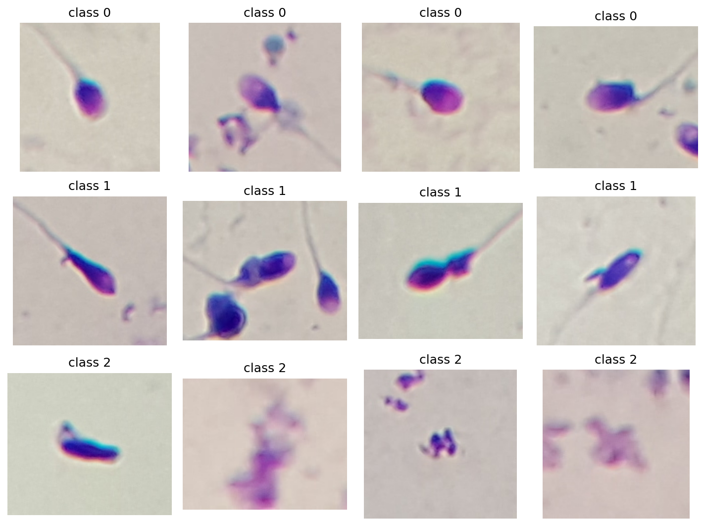
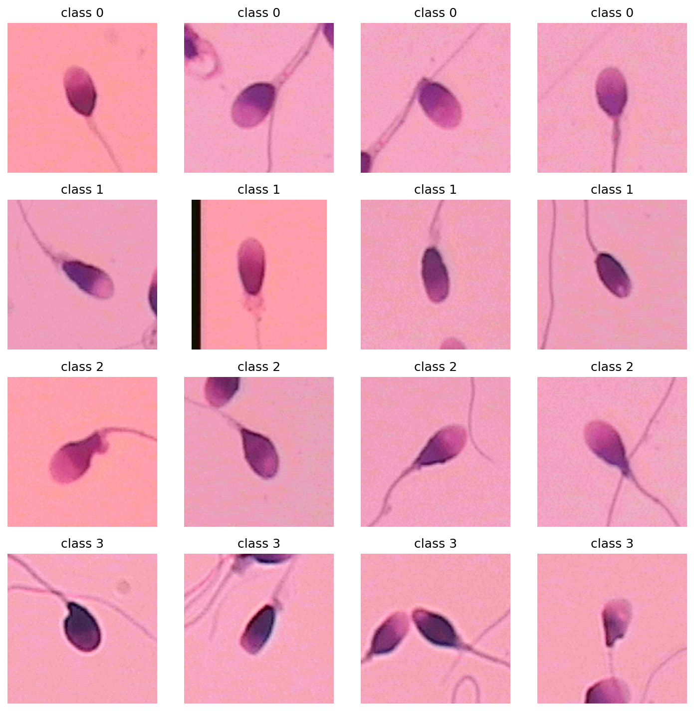
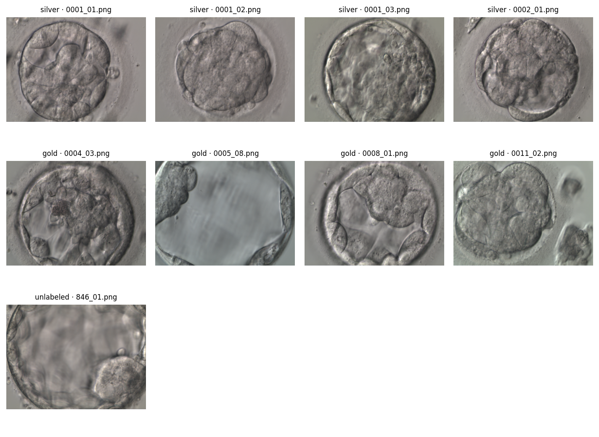

# Public data audit

I completed this audit on 2026-08-31 in the America/Los_Angeles time zone. I verified archive checksums before decoding images with Pillow. Machine-readable audit records are under `results/audits/` and sample figures are under `results/figures/`.

## SMIDS

The archive SHA-256 is `f46868e3a957414da55793973f75394ad2469fed48d3368e7f7f8a3aa59780a3`, matching the Mendeley version 1 manifest. I decoded 3,000 RGB images with no decode failures and no exact-byte duplicates. The class counts are 1,021 normal, 1,005 abnormal, and 974 non-sperm images. The images have 1,914 distinct width and height pairs, with widths from 122 to 259 pixels and heights from 80 to 264 pixels. A content issue affects 480 files that use a `.bmp` suffix but have a PNG signature.

| Split | Normal | Abnormal | Non-sperm | Total |
|---|---|---|---|---|
| Train | 715 | 703 | 682 | 2,100 |
| Validation | 102 | 100 | 98 | 300 |
| Calibration | 102 | 101 | 97 | 300 |
| Test | 102 | 101 | 97 | 300 |

I used an image-stratified split because the release provides no patient or source-field identifier. Possible correlation by source field remains a limitation.

## HuSHeM

The archive SHA-256 is `aec7c19643a298386cae2399fb225b6b382a149b78d3a6d9239e842cce95de00`, matching the Mendeley version 3 manifest. I decoded 216 RGB BMP images with no decode failures and no exact-byte duplicates. The class counts are 54 normal, 53 tapered, 57 pyriform, and 52 amorphous images. Of these images, 210 are 131 by 131 pixels and six use one dimension from 118 to 127 pixels. Each outer fold contains 43 or 44 test images, 32 or 33 validation images, 22 calibration images, and 118 training images.

I used image-level cross-validation because the release reports 15 patients but provides no image-to-patient map. Correlation between images from the same patient could make the estimate optimistic.

## Kromp blastocysts

The archive MD5 is `d19532b4b6bc4792b44738b8930d9ad2`, matching Figshare version 3. I decoded 2,344 RGB PNG images at 512 by 384 pixels with no decode failures. The release contains 15 exact-byte duplicate groups, including groups that cross filename prefixes. The silver annotation file has 2,044 rows for 2,043 unique filenames. The gold file has 300 rows for 300 filenames with no overlap.

I did not create a Kromp split because the paper reports 837 patients but the release provides no patient identifier or map. Filename prefixes produce 851 groups and do not match the reported patient count. The file `838_02.png` appears twice in the silver annotations with conflicting expansion labels, while `846_01.png` is present without a released label. The public gold set is image-level and crosses inferred filename-prefix groups.

`src.data.prepare` requires an author-verified patient map and raises an explicit error for conflicting labels. I do not report a Kromp model result.

